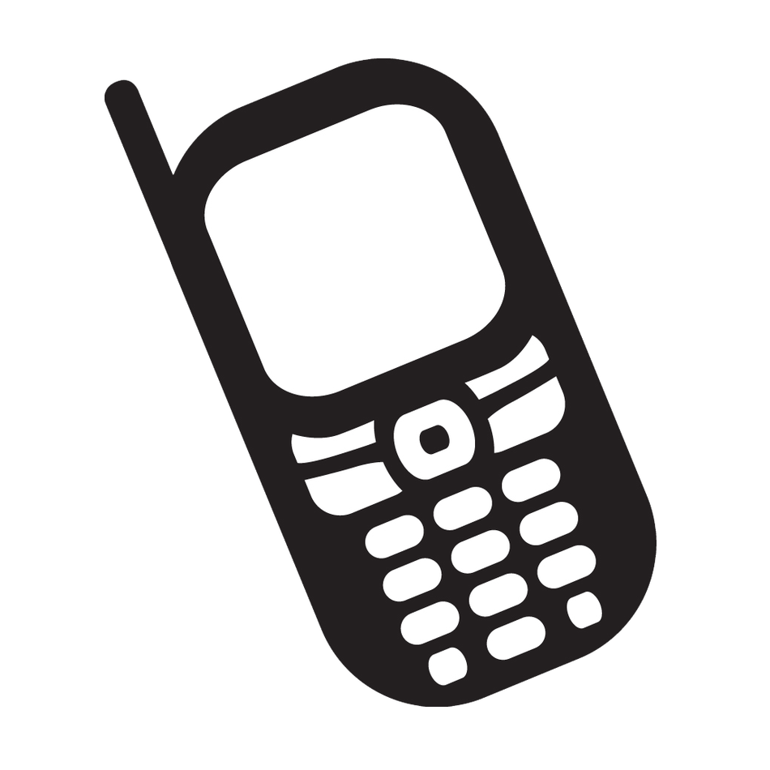

Imagine this; you drop your phone in the crack between you bed and the wall. The only thing tethering it to this world is it’s charger, which will easily unplug if jerked too much. You pull. Carefully, gently, twisting the corder in a vain attempt to shift the slant of your phone. But it is lodged in at an angle that shouldn't be possible by virtue of the way it fell.  Lost in the divide, it taunts you. Your chest burns and constricts. You had held your breath in anticipation, giving full focus the rescue, but it has taken too long and the lack of air hurts but the lack of phone is far more concerning. You cannot abandon this quest. With a deep breath, you jiggle the charger. This does nothing, and you knew that. The frustration builds, until suddenly a ping echoes through and under the caverns of your bed. A text. Stubbornness gives way to urgency, exasperation to  determination. Finally, you concede. Instead of trying to free the darn thing from atop your bed, you get off and pull the mattress out of bit. The newly created gape is just enough to fit your fat hand and save the phone. Of course, the text probably wasn’t that important but the relief of the reunion soothes your very soul. 

Trying to create a website with only HTML and CSS is like trying to life rope your phone from the the space between your bed and the wall. It’s the hard way to do something that has a more efficient solution. I say efficient instead of easier because ast first it feels like much more effort; the amount of extra effort it takes to get up and the extra effort it takes to learn how a new framework works.  When going to hard way, the results are hardly ever desirable, it takes longer, there is a real chance you will make things more difficult for yourself in the long run, it's frustrating, its ugly to look at, and your options are limited. This list of complaints applies to both phone fishing and pure HTML CSS coding. You can pull to hard and accidentally lose the only chance you had to retrieve your phone the hard way, you can make three columns but they will only be even at one specific window size. You can jiggle to cord with no results, you can try make fancy things like a menu drop down tag with no results. 

Creating a website using Semantic UI is the efficient solution. It may take more of an effort to get up off your bed and then pull a heavy mattress but look at the alternative; sitting frustrated for an extended period of time making little or no progress. With the extra effort it takes to set up and lear how to use Semantic UI you are saving yourself from long nights of tweaking on the spacing between menu items. 
