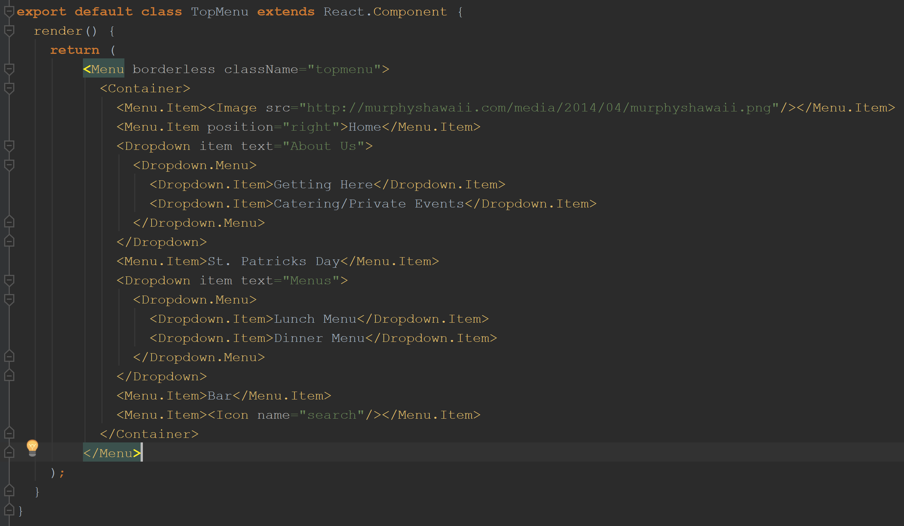

The old phrase *"don't judge a book by its cover"* is intended to chaste people from making superficial decisions. Not a terrible message, however, when actually choosing books most people do make much of their decisions based on the cover. This tactic actually works because cover art is specifically designed to reflect the content and tone of the book. If you have no interest in something like zombies and the cover art has zombies you don’t even have to read the summary to know its not of interest to you. This same mindset can be applied to code as well. Before you even start reading code you can see how well formatted it is; are the brackets lined up, is the spacing even, what type of variable names do they use. The aesthetics of how code is formated can affect, not only the code's overall readability but, the author's credibility as well. 

As I discussed in my other essay, [“The Greeks Knew A Few Things”](https://neezcha.github.io/essays/semantics.html), the author’s credibility, their ethos, will change how the reader interprets the given information. In the case of coding, irregular formating can give the impression of a patchwork code that the author doesn't fully understand; short variable names that don’t reflect the variables purpose can make the author seem lazy and code difficult to understand. With these negative views, even functioning code will be dismissed as ‘something too unpleasant to bother with.’  Also addressed in the previously mentioned essay, it the idea of professionalism. Showing the world your frankenstein code is like submitting a ruft draft essay for your final paper. It simply won't do. Inconsistencies, spelling errors,  poorly explained thought processes, will confuse and frustrate even the most experienced reader. 
	
In an increasingly interdependent world it is becoming rarer and rarer for anyone to be able to work in a bubble. This means, for coders, that there will be many, many collaborative projects; colab projects are difficult to begin with, but if one member of the group is adding a mess of information incomprehensible by the rest, then they doing more damage good. By adhering to a pre agreed upon coding standard, everyone can focus on the content instead of wasting time trying to decipher what someone else is doing. This applies to code only worked on by one person; you are not the same person at 3am as you are at 3pm, so what may have seemed like a stroke of genius at the am will seem like stroke of madness at the pm. So help your fellow coders and yourself out, follow the stet standards. Learning and incorporating them may take some effort but it is far less effort than the chaos ensued by messy code. 

## Coding Standards 

Above is an example of code formatted in adherence to ics-se-code style for JavaScript Coding Quality Tool ESLint, Javascript version ECMAScript6, as required for ICS 314. Notice how the variable *className="topmenu"* unambiguously represents what the variable stands for, and how each indented level represents the different scopes each element is apart of. 
