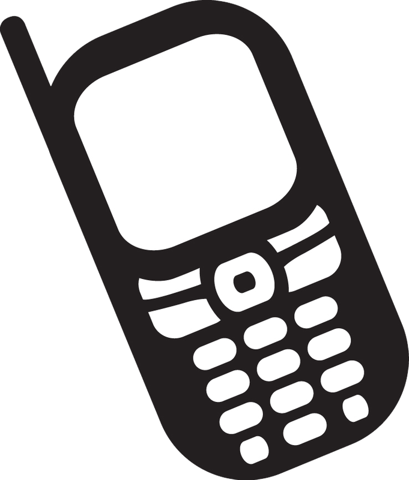
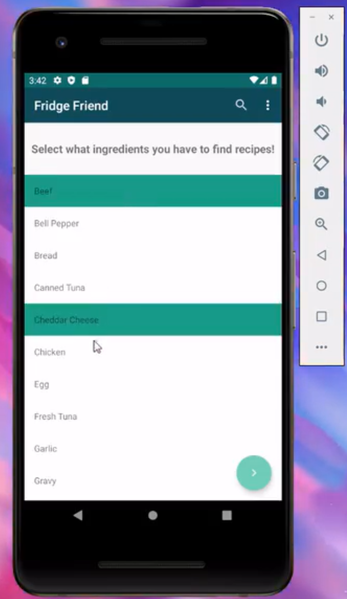
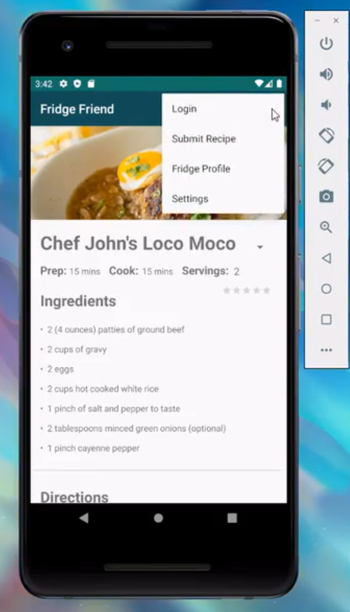
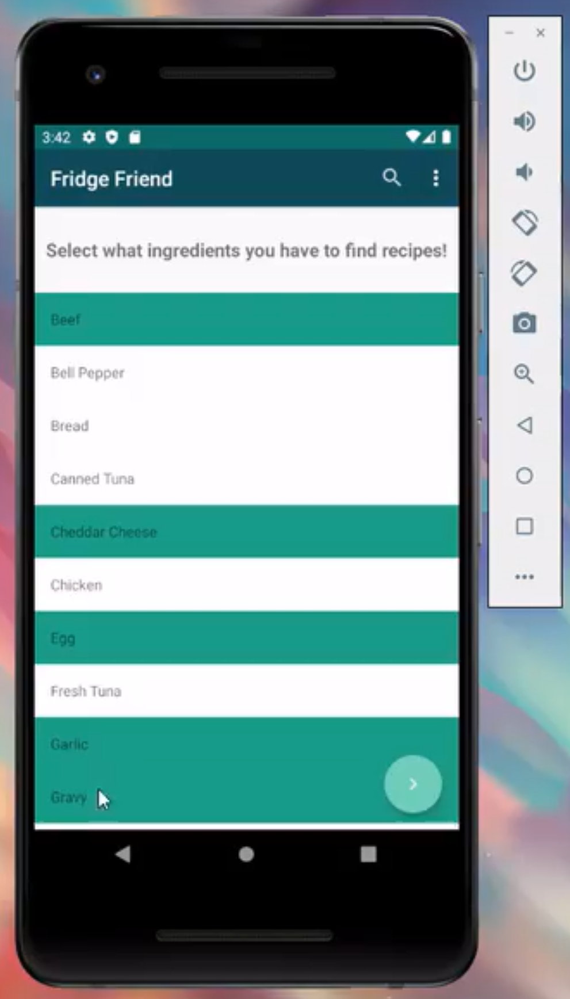

During my last semester at UHM, I took a Mobile Design class. The class was unique in that it was entrepreneur focoused. Instead of basing the whole course on a project, there were also many essays that acted as deliverables or documentation for the app, along with presentations designed to ‘sell’ the product. The prompt for other project-based classes I have taken have been technology focus, how to interact cross-platform, to explore how concepts affect production, and to practice using tools in more sophisticated ways. Mobile Design, however, took a business approach. The first milestone being concerned with marketability, competition, revenue source, potential partners or backers, and the presentation for that milestone was presented as if our group was selling a startup idea. 

##### Overview 
I enjoyed this ‘big picture’ approach to technology because it is one of the most ‘industry-oriented’ project prompts I have participated in, including practice ‘elevator talks’, product testing, and evaluations. The context for the work we did provides direction and tangibility to the project, allowing for more meaningful planning and design to happen. Taking into consideration our base functionality and how the app could grow in the future, my partner and I decided to approach the app in phases. First, to build out the main functionality of our app, and to leave room for possible revenue sources and additional features that would set us apart from the similar competition. Next, we would want to start building out some of the additional functionality and creating mockups of how we could incorporate some sponsors. 
Due to COVID-19 classes shifted online and my partner faced health concerns for him and his family, in order to accommodate the multitude of changes happening we focused on the first phase of our project and delivered our base idea of the app. 

### Fridge Friend 

Fridge Friend is an Android-based mobile application that finds recipes based on a few ingredients the user already has. As with startups, the inspiration of the app was drawn from a specific need form a specific demographic to help build robust yet unique features, then marketed as universal to potential investors. In this case, the potential investor was really our professor and target demographic were college students on a budget trying to eat healthier. Friend Friend would help with this by allowing the user to fully use the food they have, wasting less food (which is good for the environment and the wallet), and using the saved money to buy healthier options. 

### A Friend For Your Fridge

  
  
 

#### The Project’s Process
During the semester we fulfilled four milestones. The first was concerned with the *marketability* of the app, where we approached the project as a business venture. We looked at a need that needs to be filled, current competition on the market, and revenue sources. Then we wrote a paper outlining our ‘business plan’ and the design plans for the app and presented it to our class and the professor as if we were marketing to potential investors. 

The next milestone was mostly concerned with *implantation*, or rather, deliverables for the client and proof of concept. Each milestone had an essay presentation. These two were on documentation and the reasons behind implantation methods chosen. For our project, decided our landing page should be a scrolling recycler view element of ingredients with the lookup button and menu easily accessible from there but off to the side. We chose this format to speed up the lookup process for the average user. Users who want a more tailored experienced have the option to filter, sort, and save in the menu (features not implemented). Along with other mockup features also stored in the menu. 

By milestone three my partner was experiencing difficulties keeping up with the goals of the app and taking care of health concerns at home due to the pandemic. In order to free up his time but still reach a ‘product goal,’ we shifted our focus for this milestone. Instead of implementing some of the addition mocked up features, such as login (which already had a prebuilt setup in AndroidStudio), we cleaned up usability and flow of the app. This milestone was proof of *improved functionality*, in our case was the lookup feature. 
Milestone four was *testing* our product. Once again, due to the global health crisis, we had to adjust the goals of this milestone. Instead of surveying a large number of individuals from our intended demographic, we surveyed our household members and peers. Lucky for Fridge Friends, our intended demographic is college students trying to eat healthier, so our peers were we’ll fit. In order to gauge how our app performed I created a questionnaire where each question corresponded to one of Android’s Design Principles. This was chosen because it is an Android-based app, these principles are well established, known, and defined, and they covered aspects of the app we were concerned with. 

All milestones cumulated into a final essay and presentation documenting our process. 
