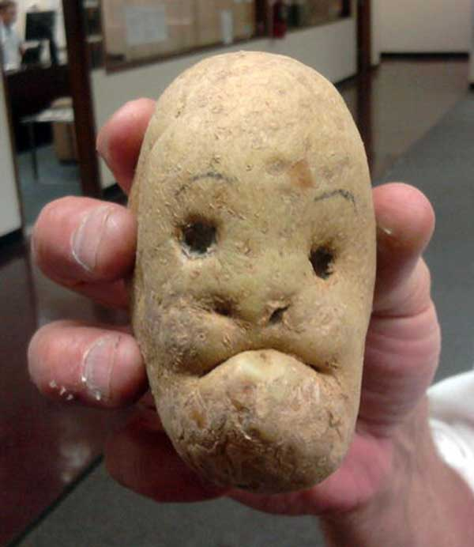

Humans are incredibly good at finding patterns in the world around us. This can be adventitious, like back in the day, connecting a certain type of berry to people getting sick could save lives. It can also be dangerous, like when someone gets sick after a flu shot and becomes convinced that vaccinations are harmful. There are also patterns that mean nothing but still find fun, like potatoes shaped like a face.

Whatever your stance on vaccinations maybe, recognizing patterns has been one of humanity's greatest assets, along with opposable thumbs.
