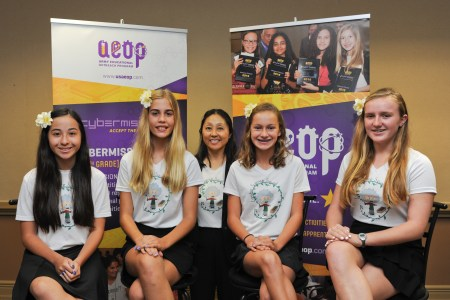

The Lanikai Science Squad—four 7th grade students who formed an Ecybermission science team, identified a community problem: 98% of Hawaii farms are using synthetic pesticides on their crops. To protect the aina, they found a more natural alternative to synthetic pesticide by making their own organic pest control. They discovered a low cost replacement for synthetic pesticide at $.13 per ounce, with natural ingredients including garlic and Hawaiian chili pepper. The data showed that organic pest control works just as well as synthetic pesticide in:

• preventing pests from damaging the crops

• encouraging crop growth

• growing with more chlorophyll, thought to be better for health

  
  

The Lanikai Science Squad competed in the Army Education Outreach Program (AEOP)’s eCyberMission Competition (ECM) they won 7th grade first place nationally, and a grant to help spread their findings to their community. I acted as a mentor to help the team fulfil the requirements of their grant. 

To help the girls stay organized and document their progress for the grant, I created and managed the website [https://dontpanicgroworganic.org](https://dontpanicgroworganic.org/) with [wordpress.com](wordpress.com). The site is a collection of the groups accomplishments form winning first places nationally, the findings of their project, and most of all, the outreach they did with their community. One of the main aspects of the grant were the Organic Garden Starter Kits. As the name implies they are starter kits for gardening organically; they contain an instructional and informative pamphlet, seeds, "Peet Pellets" which turn into soil, biodegradable pots, plant markers, and a spray bottle. These kits were passed out to individuals, groups, and schools. The girls also did quite a bit of leg work, meeting with government officials, the Kokua Foundation, and attending events. Through this experience I helped guide the students with budget planning, event coordinating, time management, as well being the photographer, video editor, and an extra pair of arms to help them carry things like the kits, brochures, or posters.

The Organic Garden Starter Kit is made available for educational purposes only. 

  
  

Sponsored by AEOP and [eCyber Mission](www.ecybermission.com)

Read more at Lanikai Science Squads [webisite.](https://dontpanicgroworganic.org/)

