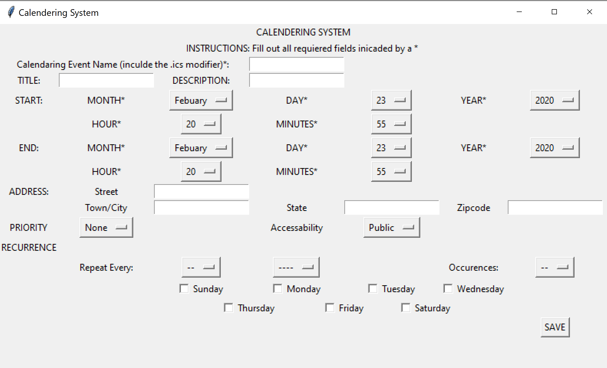

Software Engineering 2 is a project-based class, with the goal to collaborate on something that would require external interaction. Over the course of a semester, my partner and I created the interface for a calendaring system. Conforming to [RFC 5545](https://tools.ietf.org/html/rfc5545) standards we built up the features and error checking to create valid .ics files that will be readable by other applications. 

 This calendaring system is programmed in Python using Jupyter Notebooks and the `tkinter` library to create the vintage look. To the left is an empty version of our user interface. Final versions of this project offered reoccurrence options and auto-filled the time and date selection based on the user’s computer’s information. The program also checked for valid entries, such as the save file name including a .ics modifier and validating times. For example, if an event's end-time was before the start-time, an informative error explaining what is wrong would appear at the bottom of the window. Or if an invalid date, such as February 31 was selected, users would be informed via a message at the bottom of the window, next to the `SAVE` button, letting them know that the date does not exist. 

Software Engineering's project typically spans a whole semester, however, I took the course over the summer so the typical milestones occurred more often. Thankfully, my partner and I agreed that an Agile Software Development approached would help us keep pace with fast requirements. While the requirements of the milestone were often broad, the agile approach kept us building consistently. This was especially helpful for milestone 4, which did not explicitly ask for improved functionality but despite the overall functionality at the time, in order to satisfy the original project design, we needed a few more features. It was an independent class that required self-regulation during a time of year when the beach calls the strongest, but we stayed on track and delivered on our goals. 

[View Project Repo](https://github.com/ics414-teamorzo/TeamOrzo)

