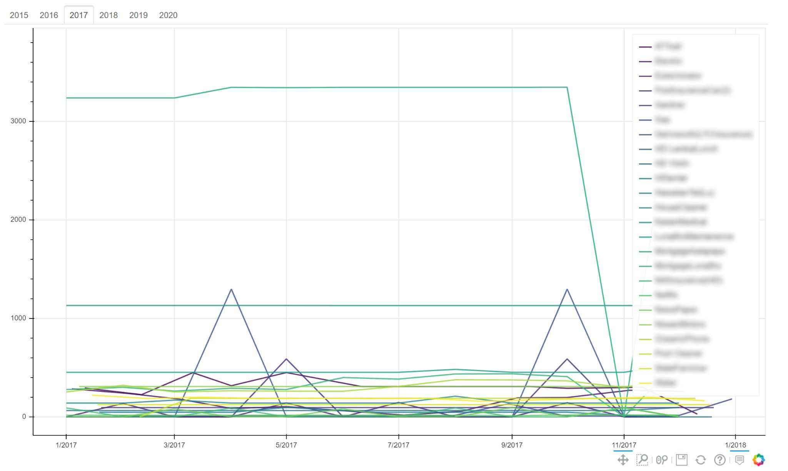

After graduation, I have been working on a personal project to practice my **Data Analysis and SQL skills on my family’s home finances**. Due to the nature of the numbers, I am working with, the numbers and categories are going to block out. From this project, I hope to give my family a better sense of our financial situation and all the good things that can come from that. I plan to create an interactive dashboard, that is clear, intuitive, and informative for my family. To do this I am using SQL to parse the CSV sheet I created in Excel while digitizing my family’s records, along with Python on Jupyter Notebooks using the libraries Pandas and Numpy to interact with the information, and the Python library Bokeh to create the interactive dashboard. 

### Data Wrangling
After digitizing my family’s records from their analog origins, I charted some basic graphs to check for any errors or outliers. What I noticed from the bar graph is that one field was significantly larger than the rest. So much so that the other field’s amounts were too small to be seen, this seemed odd considering the average payment amount was small in comparison with other payments. Along with that, the Pie graph confirmed this anomaly and show two others, smaller but still much larger than they should have been.  Using the SQL statement shown below I isolated the anomalies. These numbers turned out to be a recording error and were fixed on the CSV sheet. 

  
   
  
  

 
### Data Visualization

The first step of data visualization is plotting the payees, our household outflow of cash. This was prioritized to determine the biggest expenses and potential areas for saving. 

 
On the right is the pie chart representing the proportional amount paid per payee. The chart is interactive with Bokeh’s built-in zoom features, as well as custom tool tips indicating the name of the payee, the percent they take up of the total cash outflow, and exact amount paid. Next I plan to categorize the payees by Needs, Wants, Savings and comparing the percentages to the 20/50/30. 

 
On the right is the line charts, plotting the amount paid to each payee over time. Each year is split into tabs. The names of each payee has been blurred per request. This chart also has Bokeh’s interactive zoom and custom tooltips. The legend to the right of the graph hides any selected payees, to clean up the chart and make it easier to read. 
