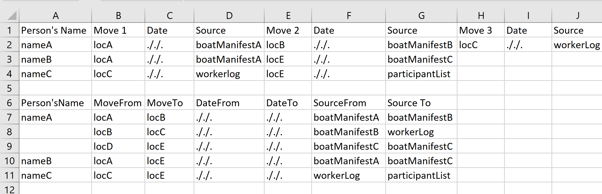

 Volunteering at the *Japanese Cultural Center of Hawai’i* ([JCCH](https://www.jcch.com/)) was a real treat. Everyone is friendly and kind, and I was able to apply the skill I have learned as a Computer Science student to help my community. JCCH has a few different databases that often relate to each other (a relational database you could say). When I first arrived, I spent some time getting to know the type of information stored, how it is used, and how it relates to other information within the same database and between other databases. 

### Restructure the way data is stored 

Understanding the type of information stored in JCCH’s databases was extremely important to take into account when structuring how the information is stored. When keeping tracking of individuals journeys through key points in history there is often inconsistent documentation available, and new information may show up much later. For example, tracking the moves a person made from one location to another, even when they are part of a group moving on a boat, there are still individual differences. A person or a family may have stayed at an intermediary port instead of continuing their journey with the rest of the group. To keep these unique experiences preserved JCCH works hard gathering information and organizing it into a clear and accessible format. 

 

Above is an example of how I recommended restructuring the way information is stored in the excel sheet. Rows 1-4 are an example of how the information was stored before. This format caused problems when new information was discovered. If a new intermittent move is discovered, additional columns would be inserted and threw off the `moveNum` column header count correlation. **Rows 6-11 are how I recommended to store the information.** It is much clearer how many moves a person has taken and the relevant information regarding those moves. Person nameA has a gap in information from move `locC` to `locD`, if the transition is found it will be easy to add a new row without throwing off formatting for other people listed. 

### Excel Macro

The first project I worked at JCCH was creating a macro using Excel VBA for one of the databases. This macro was designed to link the photo name to the photo location, when clicked the photo would open. It also linked the photo number to the photo folder. The photos were stored across different folders with varying number of formatting 

### Miscellaneous Technology

The Japanese Cultural Center of Hawai'i works hard to provide accessible information to the public and help researchers find records fast. During my time volunteering there it felt like they were always undertaking a new task and striving to make things run smoother for their staff, volunteers, patrons, and the community. Naturally, this means miscellaneous tasks would pop up, and when they were technologically related I was there to help. This includes making a PowerPoint scrolling through a list of names for those interned in Hawai'i during WWII and giving advice when planning for future projects or connecting two databases. 

[View JCCH's website.](https://www.jcch.com/)

