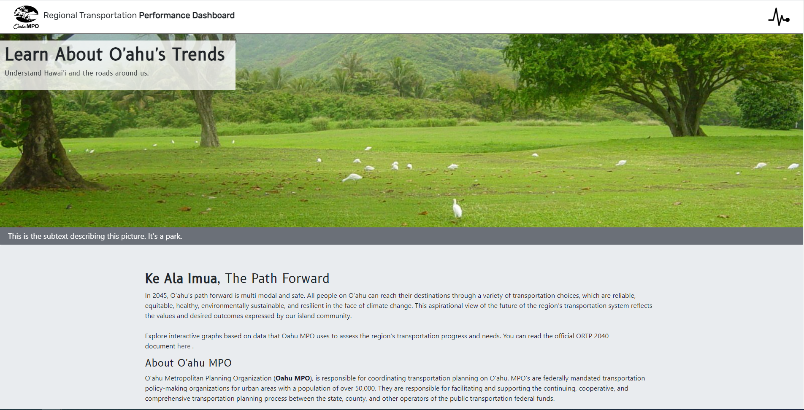
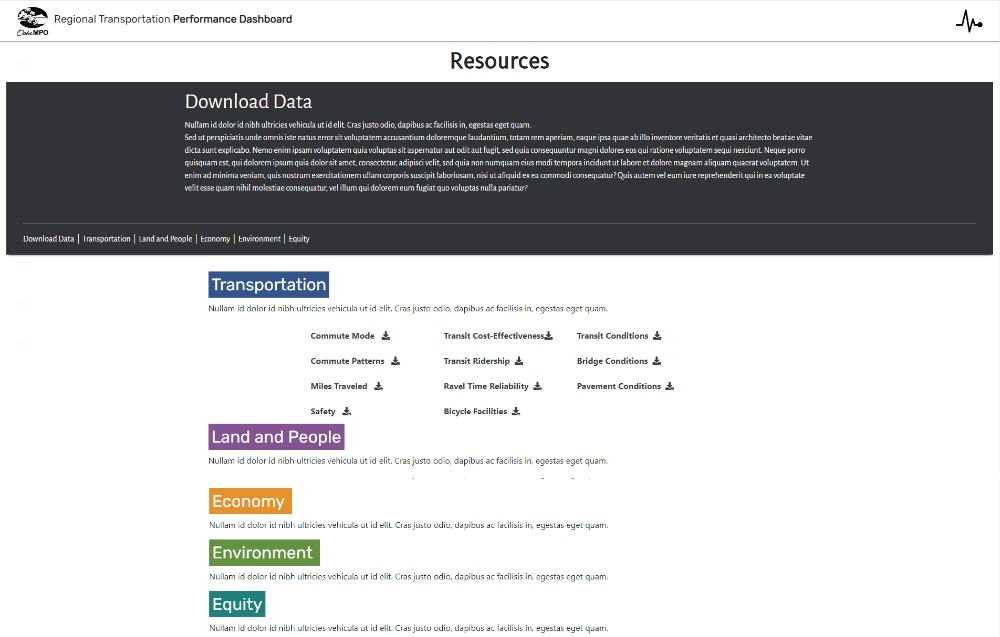
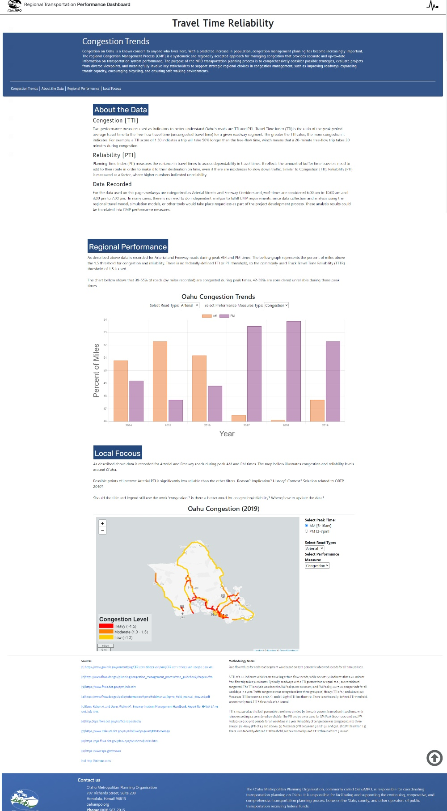
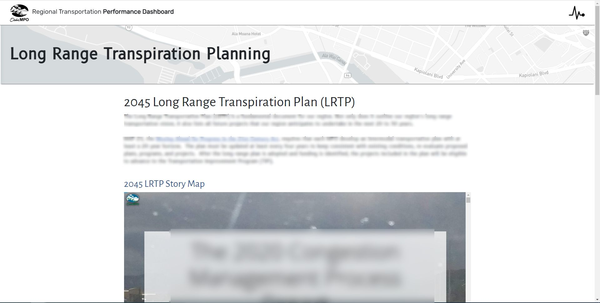

## O’ahu MPO’s ORTP Dashboard
The O’ahu Metropolitan Planning Organization (**“Oahu MPO”**), is responsible for coordinating transportation planning on O’ahu. They focus on the development of plans and programs to produce an integrated inter-modal surface transportation system. Oahu MPO does not construct projects or implement programs. To learn more about them you can visit their website [here]{https://www.oahumpo.org/}. 

My primary duties at Oahu MPO were to create a *public-facing dashboard* to provide updated information on Oahu MPO’s data and regional transportation decision-making process. The project was never launched due to a change in priorities during my internship. During my time I rendered a few mockup pages. 

### Bootstrap Studio 
For quicker page construction Oahu MPO had purchased Bootstrap Studio, a drag and drop interface using the Bootstrap CSS framework. With this application, I constructed the layout of the main pages. Page designs were inspired by other MPO’s Dashboards. 

Bootstrap Studio both expedited and hindered the website’s construction. The click and drag interface was most adept for simple page layouts, going so far as to have a prebuilt navbar. This simplicity, however, was difficult to override when custom code was needed. Often time the other elements on the page would not recognize the custom code and overlap when displayed. My workaround was to encapsulating the custom code in a prebuilt Bootstrap Studio element. 

Bellow, you can see the *landing page* for the dashboard. The photo is displayed within a pre-built Bootstrap Carole. The JS functionality adds automatically and needed minimal changes to customize from sliding transitions to fading. 



Bootstrap Studio was best suited for simple pages such as the one below. With basic links and icons for downloading the data as .csv or .pdf, and linking to locations within the same page. 



### JavaScript Libraries 
Two different JavaScript libraries were used to visualize the two different types of data being represented. **Leaflet.js** and **Charts.js** were used to interactively visualize the data, classic JavaScript was used to read, format, and interact with the data. 

*Leaflet.js* is an open-source JS library designed to build maps. Geographic data (of O’ahu’s roads) was stored as .shape files and converted to .geojson files, then read with JS `async functions`. Leaflet.js was used because the planners at Oahu MPO also used Leaflets for the maps they render in R. 

Leaflet offers many customizations features for mapping. For example, the code sample bellow was used to create a legend based on the data displayed in the map. The HTML code to create color blocks and text displayed on the map were created in this JS code. 
```var legend = L.control({position:'bottomleft'});
    legend.onAdd = function(myMap){
        var div = L.DomUtil.create('div', 'legend');
        var labels = ["Heavy (>1.5)", "Moderate (1.3 - 1.5)", "Low (<1.3)"];
        var grades = ["Heavy Congestion", "Moderate Congestion", "Light Congestion"];
        div.innerHTML = '<div><b>Congestion Level</b></div>';
        for(var i=0; i<grades.length; i++){
            div.innerHTML += '<span style="background:' 
                + styleTTI3(grades[i]) + '">&nbsp;&nbsp;</span><text> '
                + labels[i] + '</text><br>';
        }
        return div; 
    } 
    legend.addTo(myMap);   
```

*Charts.js* is a JS library for data visualization via 8 different char types, and chart enhancements; such as shaded areas under a line and mixing chart types. 
 
Bellow, is the JS function `changeGraph` used to read the HTML elements value and change the data displayed on the charts.js graph. Function `reemoveAllData` and `addNewData` are both custom made functions to interact with charts.js. 
``` function changeGraph(){
    let roads = selectRoad.options[selectRoad.selectedIndex].value;
    let measures = selectMeasure.options[selectMeasure.selectedIndex].value;

    var newData = toggleData(allData, roads, measures);

    removeAllData(chart);
    addNewData(chart, 0, newData.get('AM'));
    addNewData(chart, 1, newData.get('PM'));
  }
```

---
### The Dashboard 
The dashboard is a combining the page layouts from Bootstrap Studio, the charts from charts.js, and maps from leaflet.js. You can see this most clearly on the *Travel Time Reliability(TTR)* page. Of all the planned pages, this was the closest to completion. The top Jumbo Message is an overview of what TTR is and why it is measured. The *About the data* section explains performance measures that are charted later on the page. *Regional Performance* and *Local Focus* showcase the data from Oahu MPO. Data is stored on Github because Bootstrap Studio only allows certain file types to be hosted on the platform. It is then rendered with JS functions using the JS libraries explained above. The last part of the page below list the sources and methodology note relevant to the data displayed. 


Bootstrap Studio came with many prebuilt features that speed the creation of pages up. For example, the social media icons at the bottom required little editing to seamlessly add to the page footer. However, designing more unique page functionalities was a battle against these pre-built elements. The drop-down menu below the header was particularly difficult to implement. Other elements built by Bootstrap studio would not recognize or would reformat when the drop-down menu was selected. The menu appears after selecting the top-right icon, each tab (Transportation, Land and People, Economy, etc.) has its own color that changes the options and color of the page selection area, and the rest of the page is greyed out, so if clicked the tab will collapse. 


---

### Arc GIS Story Maps 
The first part of my internship focused on the dashboard described above. The second part involved Arc GIS Stroy Maps. Arc GIS is a collection of softwares focused on geographic mapping. Arc GIS Story Maps is the online platform used to display and share maps created with the Arc GIS Pro mapping software. 

In Arc GIS I helped with the existing Story Maps by editing and updating them, as well as creating shortened versions for future presentations. 

Below is a page from the Dashboard, added later in my internship. This page used the HTML tag `iframe` to embed a story map related to the page’s content. 




