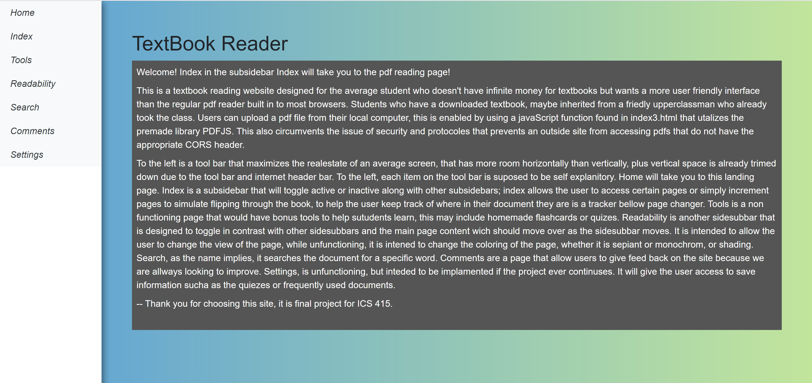

For ICS 415 Intro to Programming for the Web, I designed a [website](http://www2.hawaii.edu/~neezcha/textbook/landing.html) that will load and display a pdf file hosted on the user’s computer. The prompt for this project was to redesign a preexisting website we have found to be poor in user experience and or functionality. I chose to redesign the textbook reader for ICS 469 Cognitive Science textbook, which I was also taking that semester. The site made good use of the screen retail space with a vertical left-aligned menu and the preexisting expectation that reading text off a computer screen will not require a user to drastically read from one end to the other but maintain a comfortable center column span. The general layout was decently planned for functionality and catering to the user’s expectations. Preserving these positive qualities, I focus ed on improving the website’s shortcomings; a noncollapsable sub-menu, which shifted the main content to the right of the screen, which throws off the ‘status-quo’ that large bodies of text are left-aligned and or centered. The site also included many icons and a half working features. While many of these features have been improved upon since, while I was using the class and building the website, the extra icons and notifications were all clutter interfering with my reading. 

A surprising amount of time was spent on the fluidity and design of the side menu. The main menu far left would always be visible and submenus would toggle to display while shifting the content of the page over so that the pdf will always be centered.  

The largest milestone during this project was accessing the pdf. There are many tutorials online and the platform`PDF.js` to help with reading a displaying a document, however, the project is hosted on `UHUnix`, a Linux based environment available to UHM students. `UHUnix` has a max space limit for students so storing PDFs on my website would max out the storage which I also needed for other classes at the time. I was unable to load documents from another host website because of `Cross-origin resource sharing (CORS)` I did not have access to those documents (even if I posted them to my account).  There is a possible workaround to this issue using proxy server request, however, based on the intended demographic for this website I found another solution. The original purpose of the website was to be a textbook reader for students who are tired of the clutter and right alignment of the other site. These types of students are often tech-savvy enough to have a downloaded version of these textbooks or know how to acquire one. 
PDFs would be uploaded by the students to read on the website. This solves the hosting space issue and the access issue discovered earlier, it would also open up options for students to review other types of PDFs, such as their own essays or online articles, in addition to textbooks. 

[View Textbook Reader](http://www2.hawaii.edu/~neezcha/textbook/landing.html)
